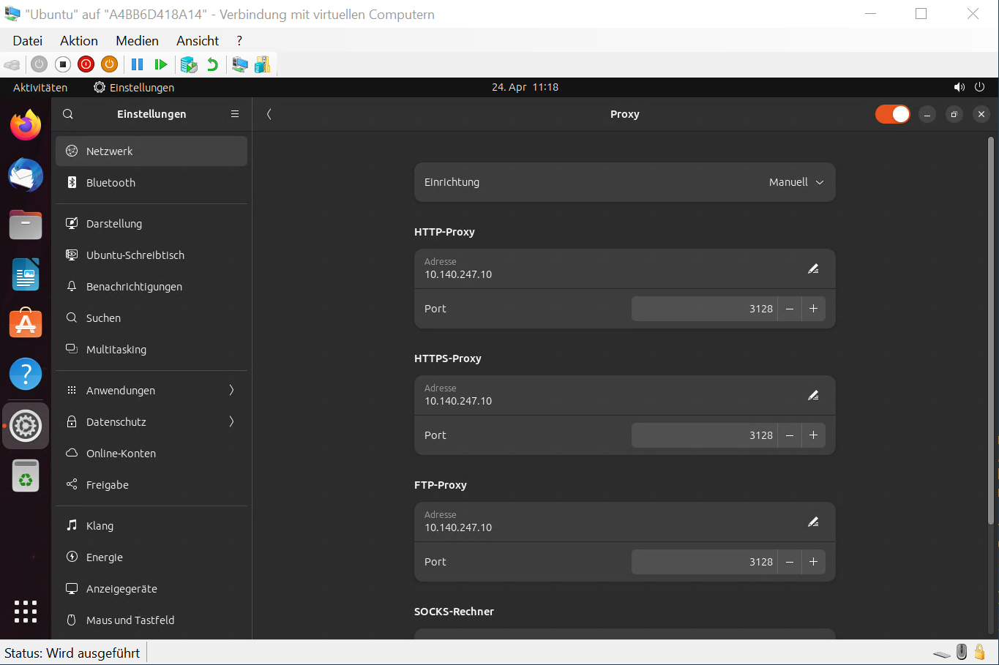

# Ubuntu mit Proxy-Server

## Umgebungsvariablen für die Verwendung eines Proxy-Server konfigurieren
Für alle Benutzer Umgebungsvariablen anderer Shells für die Verwendung eines Proxy-Server konfigurieren:
```
echo 'http_proxy="http://10.140.247.10:3128"' | sudo tee -a /etc/environment
echo 'https_proxy="http://10.140.247.10:3128"' | sudo tee -a /etc/environment
echo 'ftp_proxy="http://10.140.247.10:3128"' | sudo tee -a /etc/environment
```
## GUI-Programme konfigurieren
Unter "Aktivitäten" -> "Einstellungen" öffnen und den Reiter "Netzwerk" auswählen. Unter "Proxy" dann die "manuelle" Konfiguration wählen und einen Proxy-Server und Proxy-Port für HTTP, HTTPS und FTP konfigurieren:



(oder)

## Paketmanager "apt"
Den Paketmanager "apt" für die Verwendung eines Proxy-Server konfigurieren:
```
echo 'Acquire::http::Proxy "http://10.140.247.10:3128";' | sudo tee /etc/apt/apt.conf.d/80proxy
```
## Umgebungsvariablen für "bash"-Shell konfigurieren
Für alle Benutzer Umgebungsvariablen unter "bash" für die Verwendung eines Proxy-Server konfigurieren:
```
echo 'export http_proxy="http://10.140.247.10:3128"' | sudo tee -a /etc/bash.bashrc
echo 'export https_proxy="http://10.140.247.10:3128"' | sudo tee -a /etc/bash.bashrc
echo 'export ftp_proxy="http://10.140.247.10:3128"' | sudo tee -a /etc/bash.bashrc
```